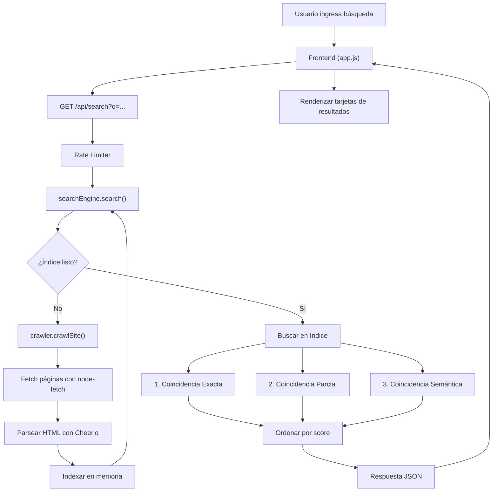
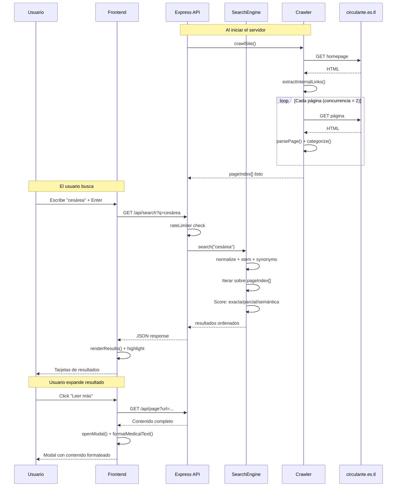

# Circulante Search Engine — Documentación Técnica

> Motor de búsqueda interno inteligente para [circulante.es.tl](https://circulante.es.tl)  
> **Autor**: Gonzalo Mazza · **Versión**: 1.0.0

---
 
## 1. Descripción General

**Circulante Search** es una aplicación web full-stack que funciona como un **buscador inteligente** sobre el contenido del sitio [circulante.es.tl](https://circulante.es.tl), un portal dedicado a procedimientos quirúrgicos, instrumentación y enfermería quirúrgica.

La aplicación:
1. **Crawlea** automáticamente todas las páginas del sitio al iniciar.
2. **Indexa** el contenido extraído en memoria.
3. Permite al usuario **buscar** con coincidencias exactas, parciales y semánticas.
4. Presenta los resultados en una **interfaz web moderna** con diseño dark/glassmorphism.

---

## 2. Stack Tecnológico

| Capa | Tecnología | Propósito |
|------|-----------|-----------|
| **Runtime** | Node.js | Entorno de ejecución del servidor |
| **Framework** | Express.js 4.x | Servidor HTTP y enrutamiento REST |
| **Scraping** | Cheerio 1.x | Parsing de HTML (similar a jQuery server-side) |
| **HTTP Client** | node-fetch 2.x | Requests HTTP para crawlear el sitio |
| **CORS** | cors | Habilitar Cross-Origin requests |
| **Frontend** | HTML5 + CSS3 + JS Vanilla | SPA estática servida por Express |
| **Tipografía** | Inter (Google Fonts) | Fuente principal de la UI |

---

## 3. Arquitectura del Proyecto

```
gonzalobuscador/
├── server.js                 # Entry point — Express server
├── package.json              # Dependencias y scripts
├── vercel.json               # Configuración de Vercel (rutas, funciones)
├── .gitignore
│
├── api/
│   └── index.js              # Serverless entry point para Vercel
│
├── services/                 # Lógica de negocio
│   ├── crawler.js            # Crawler/scraper del sitio
│   ├── searchEngine.js       # Motor de búsqueda multi-nivel
│   ├── textUtils.js          # Utilidades de texto (NLP básico)
│   └── cache.js              # Sistema de caché LRU en memoria
│
├── middleware/
│   └── rateLimiter.js        # Rate limiting por IP
│
├── routes/
│   └── search.js             # Endpoints REST de la API
│
└── public/                   # Frontend estático (SPA)
    ├── index.html            # Página principal
    ├── css/styles.css         # Sistema de diseño completo
    └── js/app.js              # Lógica del cliente
```

### Diagrama de Flujo de Datos



---

## 4. Componentes del Backend

### 4.1 Servidor (`server.js`)

Punto de entrada de la aplicación. Configura Express con:

- **CORS** habilitado para cualquier origen.
- **Body parsers** para JSON y URL-encoded.
- **Archivos estáticos** servidos desde `/public`.
- **Rutas API** montadas bajo `/api`.
- **Catch-all** que sirve `index.html` para comportamiento SPA.
- **Error handler global** que devuelve JSON con código 500.
- **Crawl inicial** al arrancar: al iniciar el servidor, ejecuta `crawlSite()` para tener el índice listo antes de recibir búsquedas.

**Puerto**: configurable vía `process.env.PORT`, default `3000`.

---

### 4.2 Crawler (`services/crawler.js`)

Responsable de recorrer `circulante.es.tl` y extraer el contenido de todas las páginas.

#### Configuración

| Parámetro | Valor | Descripción |
|-----------|-------|-------------|
| `BASE_URL` | `https://circulante.es.tl` | URL base del sitio objetivo |
| `CONCURRENCY` | 2 | Workers simultáneos de crawling |
| `TIMEOUT_MS` | 15000 ms | Timeout por request HTTP |
| `MAX_RETRIES` | 2 | Reintentos por página fallida |
| `CRAWL_DELAY_MS` | 500 ms | Delay entre requests (cortesía) |
| `CRAWL_TTL` | 1 hora | Tiempo de vida del índice antes de re-crawlear |

#### Funciones Principales

| Función | Descripción |
|---------|-------------|
| `crawlSite()` | Ejecuta el crawl completo. Previene crawls concurrentes. Reutiliza datos si el TTL no expiró. |
| `fetchWithRetry(url)` | Fetch con AbortController para timeout y reintentos con backoff exponencial. |
| `extractInternalLinks(html)` | Extrae links internos (`.htm`) usando Cheerio. Resuelve URLs relativas. |
| `parsePage(html, url)` | Extrae título, contenido limpio y categoría de una página HTML. |
| `categorizeUrl(url, title)` | Clasifica la URL en una sección médica (Traumatología, Neurocirugía, etc.) usando regex. |
| `crawlBatch(urls)` | Procesa un lote de URLs con concurrencia limitada y cache check. |
| `getIndex()` | Retorna el índice actual sin recrawlear. |
| `getCrawlStatus()` | Devuelve estado: páginas indexadas, última ejecución, si está en progreso. |
| `getPageByUrl(url)` | Busca una página específica en el índice por URL. |

#### Proceso de Crawl

1. Fetch la homepage y extraer todos los links internos (`.htm`).
2. Parsear la homepage como primera página.
3. Crawlear todas las páginas descubiertas en batches con concurrencia = 2.
4. Deduplicar por URL.
5. Almacenar en `pageIndex[]` (array en memoria).

#### Categorías Médicas Detectadas

Traumatología · Neurocirugía · Cirugía General · Urología · Ginecología · Cirugía Vascular · Anestesiología · Mastología · Cirugía Plástica · Cirugía de Tiroides · Cabeza y Cuello · Columna/Artroscopia · Coloproctología · Recursos y Tips · Accesos Venosos · Contacto · Inicio · General

---

### 4.3 Motor de Búsqueda (`services/searchEngine.js`)

Motor de búsqueda con **tres niveles de coincidencia**, evaluados en cascada:

#### Nivel 1 — Coincidencia Exacta (`matchType: 'exacta'`)

- Busca la query completa (normalizada) dentro del texto completo (título + contenido).
- **Score base**: 100 + (ocurrencias × 5) + (match en título: +50).
- Si hay match exacto, no se evalúan los niveles inferiores.

#### Nivel 2 — Coincidencia Parcial (`matchType: 'parcial'`)

- Evalúa cada palabra de la query individualmente.
- **Matching directo**: la palabra aparece en el texto.
- **Fuzzy matching**: distancia de Levenshtein ≤ 2 contra las palabras del texto.
- **Stem matching**: compara raíces morfológicas (stemming español).
- Se requiere al menos 50% de las palabras coincidan (o 1 si es query de una sola palabra).
- **Score**: 50 + (ratio × 30) + (directas × 10) + (fuzzy × 5) + (título: +25).

#### Nivel 3 — Coincidencia Semántica (`matchType: 'relacionada'`)

- Busca **sinónimos médicos** de las palabras de la query en el texto.
- Compara **raíces morfológicas** (stems) de las palabras.
- **Score**: 15 puntos por sinónimo encontrado + 8 por stem compartido + (título: +20).

#### Scoring y Ordenamiento

- Los resultados se ordenan por score descendente.
- Límite configurable (default: 50, máximo: 100).
- Cada resultado incluye: `title`, `snippet`, `url`, `section`, `matchType`, `score`, `details`.

#### Caché

- Usa `searchCache` (LRU): resultados se cachean por 30 minutos.
- Clave: query normalizada.

---

### 4.4 Utilidades de Texto (`services/textUtils.js`)

Módulo de **NLP básico en español** para el procesamiento de texto.

#### `normalize(text)`
Normaliza texto: convierte a minúsculas, remueve acentos (NFD), elimina puntuación, colapsa espacios.

#### `stem(word)`
Stemmer español básico por remoción de sufijos. Procesa sufijos comunes del español ordenados de mayor a menor longitud:
```
-amiento, -imiento, -aciones, -uciones, -amente, -mente, -ación, -ición,
-encia, -ancia, -ador, -edor, -idor, -ados, -idos, -ando, -iendo, -idad,
-ismo, -ista, -ible, -able, -ado, -ido, -ada, -ida, -oso, -osa, ...
```

#### `levenshtein(a, b)`
Distancia de edición de Levenshtein (algoritmo clásico por matriz). Usada para fuzzy matching de palabras similares.

#### `extractSnippet(text, query, contextChars)`
Extrae un fragmento de contexto (~120 caracteres a cada lado) alrededor del primer match de la query. Si no encuentra la query completa, busca palabras individuales. Fallback: primeros 240 caracteres.

#### `getSynonyms(word)` / `areSynonyms(w1, w2)` / `stemSimilarity(w1, w2)`
Funciones para consultar el mapa de sinónimos y comparar raíces.

#### Diccionario de Sinónimos Médicos (`SYNONYM_GROUPS`)

51 grupos semánticos con terminología médica en español. Algunos ejemplos:

| Grupo | Términos |
|-------|----------|
| Cirugía | cirugía, operación, intervención, procedimiento |
| Fractura | fractura, rotura, quiebre, ruptura |
| Anestesia | anestesia, sedación, anestésico |
| Hernia | hernia, protrusión, eventración |
| Tumor | tumor, neoplasia, masa, cáncer, carcinoma, oncología |
| Riñón | riñón, renal, nefro, nefrología |
| Columna | columna, vertebral, espinal, raquídeo, lumbar, cervical |
| Enfermería | enfermería, enfermero, enfermera, nursing |
| ... | *(51 grupos en total)* |

El mapa se construye al cargar el módulo: cada palabra mapea a un `Set` de todos sus sinónimos.

---

### 4.5 Sistema de Caché (`services/cache.js`)

Implementación de **LRU Cache** (Least Recently Used) en memoria usando `Map` de JavaScript.

#### Clase `LRUCache`

| Método | Descripción |
|--------|-------------|
| `get(key)` | Obtiene valor si existe y no expiró. Mueve el entry al frente (MRU). |
| `set(key, value)` | Almacena un valor. Evicta el entry más antiguo si se alcanza `maxSize`. |
| `delete(key)` | Elimina un entry. |
| `clear()` | Limpia todo el caché. |
| `stats()` | Estadísticas: tamaño, máximo, entradas expiradas. |

#### Instancias Singleton

| Instancia | Tamaño Máximo | TTL | Uso |
|-----------|--------------|-----|-----|
| `searchCache` | 100 entries | 30 min | Cachear resultados de búsqueda |
| `crawlCache` | 200 entries | 1 hora | Cachear páginas crawleadas |

---

### 4.6 Rate Limiter (`middleware/rateLimiter.js`)

Middleware de limitación de tasa por dirección IP.

| Parámetro | Valor |
|-----------|-------|
| Ventana temporal | 60 segundos |
| Máximo requests por ventana | 15 |
| Limpieza automática | Cada 2 minutos (entradas expiradas) |

Cuando se excede el límite, responde con:
- **HTTP 429** Too Many Requests.
- Header `Retry-After` con los segundos restantes.
- Mensaje en español.

---

## 5. API REST

Base path: `/api`

### Endpoints

| Método | Ruta | Middleware | Descripción |
|--------|------|-----------|-------------|
| `GET` | `/api/search?q=<term>&limit=<n>` | Rate Limiter | Busca coincidencias en el sitio indexado |
| `GET` | `/api/status` | — | Estado del crawler y del sistema |
| `POST` | `/api/recrawl` | Rate Limiter | Fuerza un re-crawl del sitio |
| `GET` | `/api/page?url=<url>` | — | Obtiene el contenido completo de una página indexada |

### `GET /api/search`

**Parámetros Query:**
- `q` (string, requerido): Término de búsqueda (2–200 caracteres).
- `limit` (integer, opcional): Máximo de resultados (default 50, máximo 100).

**Respuesta exitosa (200):**
```json
{
  "success": true,
  "results": [
    {
      "title": "Cesárea",
      "snippet": "...texto con contexto...",
      "url": "https://circulante.es.tl/Ces%E1rea.htm",
      "section": "Ginecología",
      "matchType": "exacta",
      "score": 155,
      "details": ["Coincidencia exacta: \"cesárea\" encontrada 3 vez(es)"]
    }
  ],
  "query": "cesárea",
  "totalResults": 5,
  "displayedResults": 5,
  "searchTime": 42,
  "indexSize": 87,
  "fromCache": false
}
```

**Errores:**
- `400` — Query faltante, muy corta (< 2 chars) o muy larga (> 200 chars).
- `429` — Rate limit excedido.
- `500` — Error interno del servidor.

### `GET /api/status`

**Respuesta:**
```json
{
  "success": true,
  "crawler": {
    "pagesIndexed": 87,
    "lastCrawlTime": "2026-03-10T22:00:00.000Z",
    "crawlInProgress": false,
    "isFresh": true
  },
  "uptime": 3600.5
}
```

### `GET /api/page`

**Parámetros Query:**
- `url` (string, requerido): URL exacta de la página indexada.

**Respuesta exitosa (200):**
```json
{
  "success": true,
  "page": {
    "title": "Cesárea",
    "content": "Contenido completo de la página...",
    "url": "https://circulante.es.tl/Ces%E1rea.htm",
    "section": "Ginecología",
    "crawledAt": 1710108000000
  }
}
```

---

## 6. Frontend

### Tecnología
- **HTML5** semántico con meta tags SEO.
- **CSS3** vanilla con custom properties, glassmorphism, animaciones y diseño responsive.
- **JavaScript** vanilla (IIFE, sin frameworks).

### Diseño Visual

- **Tema**: Dark mode médico con acentos teal/esmeralda (`#06d6a0`, `#118ab2`).
- **Efectos**: Glassmorphism (`backdrop-filter: blur`), gradientes animados de fondo, micro-animaciones en hover.
- **Tipografía**: Inter (Google Fonts) con pesos 300–800.
- **Responsive**: Breakpoint principal en 640px.

### Componentes UI

| Componente | Descripción |
|-----------|-------------|
| **Search Box** | Input con botón de búsqueda, icono SVG animado, glassmorphism |
| **Suggestion Chips** | Botones rápidos predefinidos (Cesárea, Hernia, Anestesia, etc.) |
| **Status Bar** | Indicador de páginas indexadas y tiempo de búsqueda |
| **Result Cards** | Tarjetas con título, snippet resaltado, badges de match type y sección |
| **Modal** | Ventana modal para ver el contenido completo de una página |
| **Loading State** | Animación de carga con tres círculos con bounce |
| **Error State** | Mensaje de error con botón de reintentar |
| **Empty/No Results** | Estados vacíos con iconos e instrucciones |

### Lógica del Cliente (`app.js`)

| Funcionalidad | Detalle |
|---------------|---------|
| `performSearch(query)` | Llama a `/api/search`, maneja estados de carga/error/resultados |
| `renderResults(data)` | Genera HTML de las tarjetas de resultados |
| `highlightTerms(text, query)` | Resalta palabras coincidentes con `<mark>` |
| `formatMedicalText(text)` | Formatea texto médico: negritas en labels, listas, párrafos |
| `openModal(url)` | Carga contenido completo vía `/api/page` y muestra en modal |
| Status polling | Consulta `/api/status` cada 3s hasta que el crawl termine (máximo 2 min) |
| Keyboard | Enter para buscar, Escape para cerrar modal |

### Badges de Tipo de Match

| Tipo | Color | Label |
|------|-------|-------|
| Exacta | Verde (`#06d6a0`) | ● Exacta |
| Parcial | Amarillo (`#ffd166`) | ◐ Parcial |
| Relacionada | Azul (`#118ab2`) | ○ Relacionada |

---

## 7. Flujo de Ejecución



---

## 8. Cómo Ejecutar

### Requisitos
- **Node.js** ≥ 14.x
- **npm** ≥ 6.x
- Conexión a internet (para crawlear `circulante.es.tl`)

### Instalación y Ejecución Local

```bash
# Clonar el repositorio
git clone https://github.com/gonzalomazza-jpg/gonzalobuscador.git
cd gonzalobuscador

# Instalar dependencias
npm install

# Iniciar el servidor
npm start
# o en modo desarrollo:
npm run dev
```

El servidor inicia en `http://localhost:3000`. Al arrancar, ejecuta el crawl inicial (~30-60 segundos dependiendo de la velocidad de conexión).

### Deploy en Vercel

La aplicación está adaptada para funcionar en **Vercel** como serverless function.

#### Pasos

```bash
# 1. Instalar Vercel CLI (si no lo tenés)
npm i -g vercel

# 2. Login
vercel login

# 3. Deploy (desde la raíz del proyecto)
vercel

# 4. Deploy a producción
vercel --prod
```

También podés conectar el repositorio de GitHub a Vercel para **deploys automáticos** con cada push.

#### Cómo funciona en Vercel

- Los archivos estáticos (`public/`) se sirven vía **CDN** de Vercel.
- Las rutas `/api/*` se manejan por una **serverless function** Express (`api/index.js`).
- El crawler adapta sus parámetros automáticamente (más concurrencia, menos delay) para aprovechar el tiempo limitado de las funciones serverless.
- En la primera búsqueda tras un **cold start**, el índice se construye on-demand (~15-30s).
- Las siguientes búsquedas (en la misma instancia warm) son instantáneas.

> ⚠️ **Nota sobre el tier gratuito**: las funciones tienen un timeout de 10s, que puede no alcanzar para un crawl completo. Se recomienda **Vercel Pro** (60s timeout) para mejor experiencia.

### Variables de Entorno

| Variable | Default | Descripción |
|----------|---------|-------------|
| `PORT` | 3000 | Puerto del servidor HTTP (solo local) |
| `VERCEL` | — | Seteada automáticamente por Vercel. Activa modo serverless |

---

## 9. Consideraciones Técnicas

### Performance
- **Índice en memoria**: todo el contenido crawleado se mantiene en un array JavaScript. Esto es rápido para búsquedas pero consume RAM proporcional al tamaño del sitio.
- **Caché LRU**: evita re-ejecutar búsquedas idénticas (30 min) y re-crawlear páginas (1 hora).
- **Concurrencia limitada**: solo 2 requests simultáneos al sitio, con delay de 500ms entre ellos.

### Robustez
- **Reintentos con backoff**: las requests fallidas se reintentan hasta 2 veces con espera creciente.
- **Timeout por request**: 15 segundos vía AbortController.
- **Prevención de crawls concurrentes**: un semáforo asegura que solo un crawl se ejecute a la vez.
- **Datos stale**: si un recrawl falla, se usan los datos anteriores.
- **Rate limiting**: 15 requests/minuto por IP para prevenir abuso.

### Limitaciones
- No hay persistencia en disco: al reiniciar el servidor se pierde el índice y debe recrawlear.
- El stemmer español es heurístico (remoción de sufijos) y no cubre todas las irregularidades del idioma.
- El diccionario de sinónimos está hardcodeado y limitado a terminología médica/quirúrgica.
- No tiene autenticación ni autorización.
